# SourdoughCircle

SourdoughCircle is a social media application that allows authenticated members to post images and share their content related to sourdough with other people. Members can post, like posts, comment on posts, and also edit and delete their posts. Members can also follow other members to create a personalized feed.

# Live Page
[SourdoughCircle](https://sourdoughcircle-81aa321c22de.herokuapp.com/)

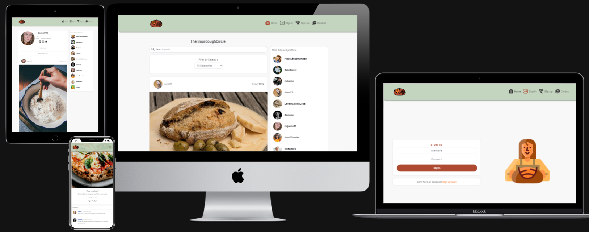

# Django Rest Backend
The repository for the backend of the application can be found here: [SourdoughCircle API](https://github.com/Hujanen91/sourdoughcircle_api)

## Table of Contents

* [Introduction](#introduction)
* [UX](#ux)
  * [User Goals](#user-goals)
  * [User Stories](#user-stories)
  * [Design Choices](#design-choices)
    * [Colors](#colors)
    * [Typography](#typography)
    * [Imagery](#imagery)
* [Features](#features)
  * [Existing Features](#existing-features)
  * [Future Features](#future-features)
* [Reusability](#reusability)
  * [Component Reusability](#component-reusability)
  * [Future Possible Reusable Scenarios](#future-possible-reusable-scenarios)
* [Packages and Tools](#packages-and-tools)
* [Testing](#testing)
  * [Manual Testing](#manual-testing)
  * [Performance and Best Practices Analysis](#performance-and-best-practices-analysis)
  * [Known Bugs](#known-bugs)
* [Deployment](#deployment)
  * [Heroku](#heroku)
    *[Initial Setup](#initial-setup)
    *[Preparing the Application](#preparing-the-application)
    *[Deployment](#deployment)
  * [Forking the GitHub Repository](#forking-the-github-repository)
  * [Making a Local Clone](#making-a-local-clone)
* [Credits](#credits)
  * [Content](#content)
  * [Media](#media)

---

## UX

### User Goals

SourdoughCircle is all about sharing your love of sourdough in a fun and supportive space. It's a place to:

1. **Show off your creations!**: Everyone loves a good sourdough picture, and SourdoughCircle lets you add your own unique twist with creative captions. It's all about capturing the essence of your sourdough journey, whatever that may be.

2. **Connect with fellow bread nerds!**: There's a whole community of people out there who share your passion for sourdough, and SourdoughCircle is the perfect place to meet them. We're all about having meaningful conversations about our bakes, from troubleshooting tips to proud moments.

3. **Find endless inspiration!**: SourdoughCircle is overflowing with amazing sourdough content. You'll see all sorts of breads, from classic loaves to artistic creations, with captions that will make you laugh, learn, and get excited to try something new.

4. **Use the platform like a breeze!**: SourdoughCircle is super easy to navigate, no matter how tech-savvy you are. Sharing your bakes and connecting with others should be simple, and that's what we've focused on.

5. **Get a feed that feels like home!**: The more you use SourdoughCircle, the more it tailors itself to your interests. You'll see content that resonates with you, so you can spend your time getting inspired, not lost in a sea of irrelevant posts.

6. **Feel safe and supported!**: SourdoughCircle is a positive space where everyone feels comfortable sharing their creations, asking questions, and learning from each other. There's no room for negativity here, just a supportive community cheering each other on.

By keeping these things in mind, SourdoughCircle is building a one-of-a-kind platform for sourdough lovers to connect, create, and be inspired.

### User Stories

The API and Frontend of this project was planned using Agile methodology and MoSCoW prioritization on github projects.

The user stories project can be found [here](https://github.com/Hujanen91/sourdoughcircle_frontend/milestones)

The project was illustrated by 13 initial Milestone entitled 
<b>"Profiles", 
"Posts", 
"Likes", 
"Comments", 
"Category", 
"Followers", 
"Admin", 
"Contact", 
"Community Chat", 
"Authentication", 
"Routing", 
"Notifications"</b> and 
<b>"Navigation"</b>  providing the developer with the freedom to accomplish all issues/tasks flexibly before dates deadline set to June. The Milestones were broken according to their components name main functions.

Throughout the development process, new milestones were added, where tasks started from "Todo," progressing to "In Progress," and finally "Done". The issues were assigned to the sole developer and labeled as "could-have," "should-have,", "must-have", "wont-have" and later on labels like "has been implemented" and "future implementation" was also added.

#### Comments
- **User Story**: Replying to comments [#44](https://github.com/Hujanen91/sourdoughcircle_frontend/issues/44)
- **User Story**: Comment date [#27](https://github.com/Hujanen91/sourdoughcircle_frontend/issues/27)
- **User Story**: Create a comment [#19](https://github.com/Hujanen91/sourdoughcircle_frontend/issues/19)
- **User Story**: Edit a comment [#25](https://github.com/Hujanen91/sourdoughcircle_frontend/issues/25)
- **User Story**: Delete comments [#32](https://github.com/Hujanen91/sourdoughcircle_frontend/issues/32)
- **User Story**: View comments [#33](https://github.com/Hujanen91/sourdoughcircle_frontend/issues/33)

#### Likes
- **User Story**: Like a post [#29](https://github.com/Hujanen91/sourdoughcircle_frontend/issues/29)
- **User Story**: View liked posts [#23](https://github.com/Hujanen91/sourdoughcircle_frontend/issues/23)

#### Navigation
- **User Story**: Navigation [#36](https://github.com/Hujanen91/sourdoughcircle_frontend/issues/36)
- **User Story**: Navigation: Conditional rendering [#13](https://github.com/Hujanen91/sourdoughcircle_frontend/issues/13)

#### Contact
- **User Story**: Contactpage [#38](https://github.com/Hujanen91/sourdoughcircle_frontend/issues/38)

#### Category
- **User Story**: Categories [#37](https://github.com/Hujanen91/sourdoughcircle_frontend/issues/37)

#### Posts
- **User Story**: Most liked posts [#45](https://github.com/Hujanen91/sourdoughcircle_frontend/issues/45)
- **User Story**: View specific users posts [#15](https://github.com/Hujanen91/sourdoughcircle_frontend/issues/15)
- **User Story**: Edit post [#18](https://github.com/Hujanen91/sourdoughcircle_frontend/issues/18)
- **User Story**: Post page [#21](https://github.com/Hujanen91/sourdoughcircle_frontend/issues/21)
- **User Story**: View posts of followed users [#30](https://github.com/Hujanen91/sourdoughcircle_frontend/issues/30)
- **User Story**: Infinite scroll [#31](https://github.com/Hujanen91/sourdoughcircle_frontend/issues/31)
- **User Story**: Create posts [#20](https://github.com/Hujanen91/sourdoughcircle_frontend/issues/20)
- **User Story**: View recent posts [#28](https://github.com/Hujanen91/sourdoughcircle_frontend/issues/28)
- **User Story**: Search posts [#34](https://github.com/Hujanen91/sourdoughcircle_frontend/issues/34)
- **User Story**: View a post [#35](https://github.com/Hujanen91/sourdoughcircle_frontend/issues/35)

#### Profiles
- **User Story**: Social media links in profile [#39](https://github.com/Hujanen91/sourdoughcircle_frontend/issues/39)
- **User Story**: User profile stats [#12](https://github.com/Hujanen91/sourdoughcircle_frontend/issues/12)
- **User Story**: Edit profile [#14](https://github.com/Hujanen91/sourdoughcircle_frontend/issues/14)
- **User Story**: Update username and profile [#16](https://github.com/Hujanen91/sourdoughcircle_frontend/issues/16)
- **User Story**: Profile page [#7](https://github.com/Hujanen91/sourdoughcircle_frontend/issues/7)
- **User Story**: Basic profile information [#22](https://github.com/Hujanen91/sourdoughcircle_frontend/issues/22)
- **User Story**: Avatar [#26](https://github.com/Hujanen91/sourdoughcircle_frontend/issues/26)

#### Community Chat
- **User Story**: Community chat [#46](https://github.com/Hujanen91/sourdoughcircle_frontend/issues/46)

#### Notifications
- **User Story**: Notifications [#43](https://github.com/Hujanen91/sourdoughcircle_frontend/issues/43)

#### Admin
- **User Story ADMIN**: Email communication [#42](https://github.com/Hujanen91/sourdoughcircle_frontend/issues/42)
- **User Story**: Email communication [#41](https://github.com/Hujanen91/sourdoughcircle_frontend/issues/41)
- **User Story ADMIN**: Respond to users mail [#40](https://github.com/Hujanen91/sourdoughcircle_frontend/issues/40)

#### Followers
- **User Story**: Follow/Unfollow [#17](https://github.com/Hujanen91/sourdoughcircle_frontend/issues/17)
- **User Story**: Most followed profiles [#24](https://github.com/Hujanen91/sourdoughcircle_frontend/issues/24)

#### Routing
- **User Story**: Routing [#11](https://github.com/Hujanen91/sourdoughcircle_frontend/issues/11)

#### Authentication
- **User Story**: Authentication: Refreshing access tokens [#10](https://github.com/Hujanen91/sourdoughcircle_frontend/issues/10)
- **User Story**: Authentication: Sign in [#9](https://github.com/Hujanen91/sourdoughcircle_frontend/issues/9)
- **User Story**: Authentication: Sign up [#8](https://github.com/Hujanen91/sourdoughcircle_frontend/issues/8)

 

[Project user stories table can be found here](https://github.com/users/Hujanen91/projects/9/views/1?layout=table&visibleFields=%5B%22Title%22%2C%22Labels%22%2C%22Assignees%22%2C%22Status%22%5D&sortedBy%5Bdirection%5D=asc&sortedBy%5BcolumnId%5D=Labels)
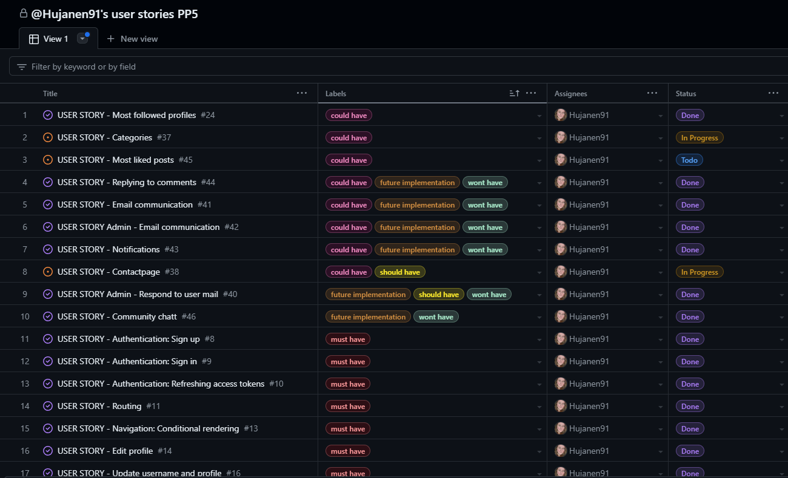

### Design Choices

- <b>Simple Navigation with Social Proof:</b> The navigation bar uses clear and concise labeling, with icons, to help users find the features they're looking for. It also incorporates a "Most Followed Profiles" section, highlighting users and potentially acting as social proof to new visitors. 
- <b>Content Previews and User Activity:</b> The bottom portion of the page showcases a section with "Search posts" and "Filter by Category" options, encouraging users to explore content. Below this section are previews of user posts, including images and captions. This gives visitors a quick glimpse into the kind of content they can expect to find on the platform. 
- <b>Muted Color Palette:</b> The color scheme uses a muted color palette of whites, greys, and a light olive green. This unobtrusive color scheme puts the focus on the content and avoids overwhelming users.

#### Colors

- <b>Primary Background:</b> The primary background color is a very light beige or off-white (#f8f8f8). This neutral color creates a clean and airy feel for the website. 
- <b>Navigation Bar:</b> The navigation bar uses a dark gray (#363636) for the icons and font. This dark color creates a clear contrast with the light background and makes the text icons easily readable.
The light background for the navbar is a light green/olive color (#bed1bae7) with some opacity to it for some effect while scrolling.
- <b>Text Colors:</b> A bluish black (#212529) is used for the fonts on the website.
- <b>Logo, highlights and hover:</b> The main logo on the page contains colors like (#ad4a31) and (#ff9254) and they have both been used on smaller details like buttons, icons and the hover colors to keep adding some pop of color 

Overall, the color palette leans towards cool neutrals with a touch of muted green, creating a sense of calmness and professionalism that aligns with the minimalist design of the website.

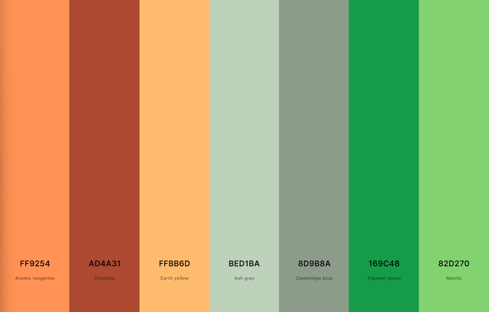

#### Typography

The font used is Barlow, a friendly and approachable sans-serif font, to make everything on the platform clear, easy to read, and inviting. 

Here's why Barlow is perfect for SourdoughCircle: 

- <b>Clear and Crisp:</b> Barlow's clean lines and open letterforms ensure all the sourdough goodness – from your post captions to comments – is easy to see, no matter what device you're using. 
- <b>Warm and Welcoming:</b> The slightly rounded edges of the Barlow typeface give it a touch of friendliness, reflecting the warm and inviting atmosphere of the SourdoughCircle community. 
- <b>Modern and Versatile:</b> Barlow's modern style keeps SourdoughCircle feeling fresh and up-to-date, while its versatility allows it to adapt to all kinds of content.

#### Imagery

SourdoughCircle keeps it simple and to the point with its app iconography.

- <b>Sourdough Icon:</b> The app utilizes a single, clean line drawing of a loaf of sourdough bread as both the favicon and the main icon in the navbar. This minimalist design makes the icon easily recognizable and ensures it scales well across different devices and screen sizes. 
- <b>Focus on Sourdough:</b> By featuring the bread itself, the icon immediately communicates the app’s purpose – a platform dedicated to sourdough bread.

- The rest of the icons and imagery follows along matching the colors and styles of the main navbar logo with clean lines, playful colors and easy for the eyes.

## Features

SourdoughCircle isn't just about pretty pictures, it's about creating a vibrant community where everyone feels welcome to share their love of sourdough. Here are some features that make it all possible:

- **User Authentication, join the Circle!**: Signing up for SourdoughCircle is quick and easy. I take user privacy seriously, so you can relax and enjoy sharing your creations in a safe and secure space.
- **Profile Management, make it your space!**: Craft a profile that reflects your unique sourdough personality. Add a bio, choose a profile picture that shows off your baking skills, add your socials and build a collection of all your posts.
- **Post Creation, sharing made simple!**: Uploading photos and adding captions to your sourdough masterpieces is a breeze. The user-friendly interface lets you tell the story behind your bake, share tips, or just show off your beautiful bread!
- **Interactive Features, connect with fellow bakers!**: Like and comment on posts to start conversations and build relationships with other sourdough enthusiasts. Share your knowledge, ask questions, and cheer each other on in your sourdough journeys.
- **Infinite Scroll, infinite inspiration!**: SourdoughCircle keeps the inspiration flowing with a never-ending stream of sourdough content. Just keep scrolling to discover new techniques, drool-worthy creations, and tips from bakers of all experience levels.

### Future Features

There are several different future implementations that could be done to the SourdoughCircle to make it even better:

- **Live community chat**: A field alwats available in the post feeds where users can chat with each other, a live chatroom or community chat.
- **Sharing to other social media**: Implement the option to share posts to other social medias.
- **Admin page specifically for handling user messages**: A page visible only to logged in admin, a frontend page to handle messages sent through the contact form where admins can answer directly to the users messages.
- **Answering other comments**: To boost the social possibilities in the community an option to answer other users comments in the comment field could be added.
- **Like or vote on other comments**: The option to like or vote others comments could be implemented for further social interactions
- **Multi image uploads**: The option to upload several images in one post where the other users then can swipe through the images in the post view
- **User status sharing**: A field next to the username or user avatar that displays a status the user can add themselves.
- **Notifications**: Live notifications for a better user experiens. Could also be used by admins to send out alerts or information to all users on the website.
- **Direct messages between users**: A private message chat to boost the social interactions. Could also be used by admins for easier contact options between admins and users.

These future implementations are just a few of many features that could improve the website further and make it even more fun to use and easier to use.

## Navbar

__Fully responsive navbar__ 

A fully responsive navbar is futured on top of the page and is always visible. On smaller screens the menu will hide in a hamburger menu bottom for a cleaner look.

  Logged out users: 
  - Home page 
  - Sign in page 
  - Sign up page 
  - Contact page 

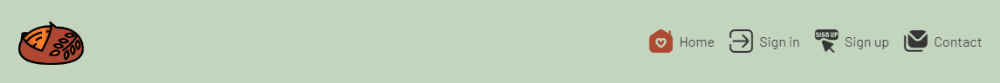

Logged in users: 
  - Add posts 
  - Home page 
  - Feed page 
  - Liked page 
  - Contact page 
  - Sign out page 
  - Profile page 

__Logo hyperlinked to home page:__

A logo is featured on all pages across the site inside the navbar, this is the main logo and makes it clear that the website is bread related. When not on home page the user will be sent back to home when clicking the Logo 
 

__Navbar on smaller screens:__

The navbar will adapt depending on screen size to keept it looking good and make every icon fit as needed.
Below is two images displaying the navbar in small screens and medium sized screens: 
 
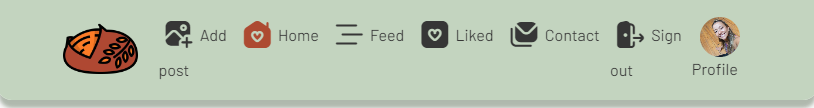 

## Home page

__The Home page consists of:__

__The posts page__

The main page where all users posts is displayed, this page is available to non authenticated users.
The homepage displays the posts, the number of comments and likes, a "most followed" box to the right where a list of the most followed users are displayed. 

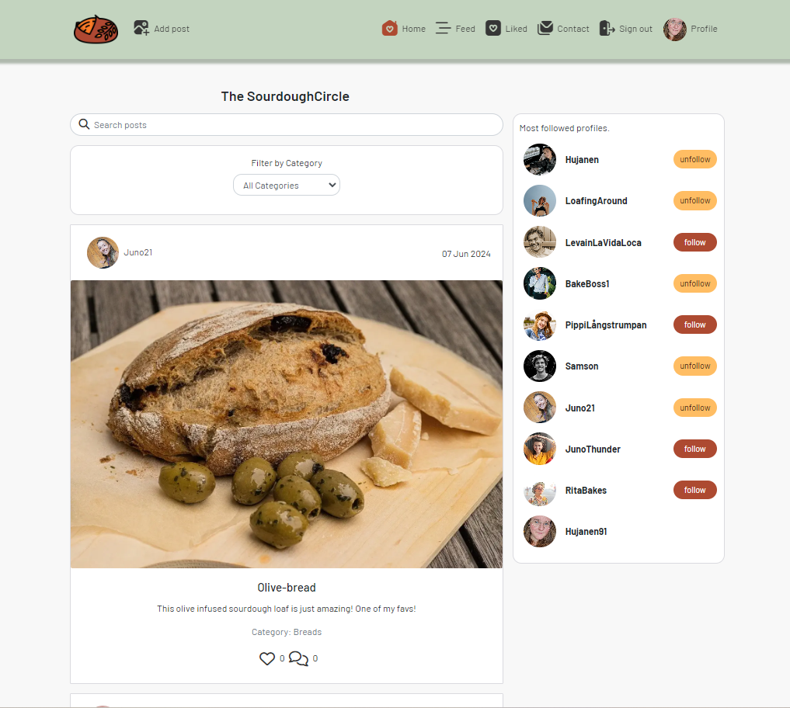 

__Most followed profiles__

The most followed profiles container sits on the right on big screens and then on the top of the page on smaller screens. The Follow/Unfollow button is hidden on smaller screens to not make the container too crouded and keep a clean look.
The most followed profiles container is visible for the user on all pages displaying posts. 

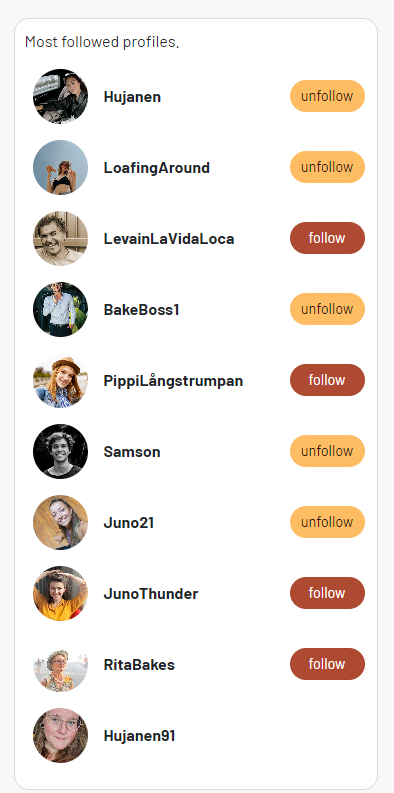 
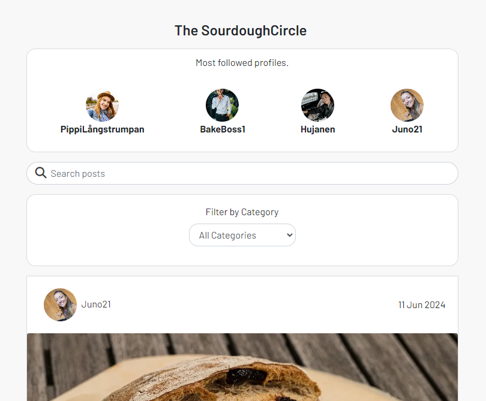 

__The website title__

The title of the website has been positioned below the navbar and above the main content on each page, this was done to save space in the navbar and not have too much happening in one place.
The title is visible on all pages except for Contact, Profile, Login and Signup page. 
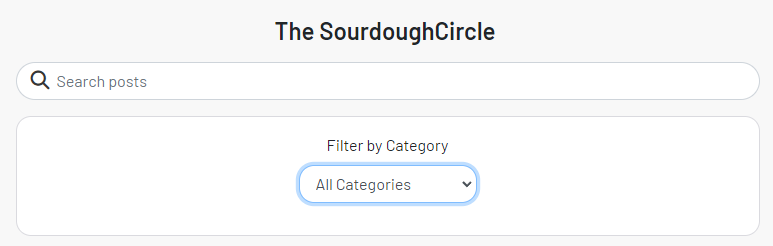 

__Searchbar__

The searchbar, a function for the user to search and find posts in a simple way.
The searchbar is displayed on the main Home page where all users posts are displayed. 
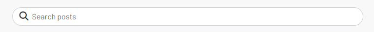 

__Category filtering__

The category filtering is a filter the user can apply at the Homepage to quickly filter posts by category. The user can click on the dropdown list and in a simple way get all the posts related to one specific category. 
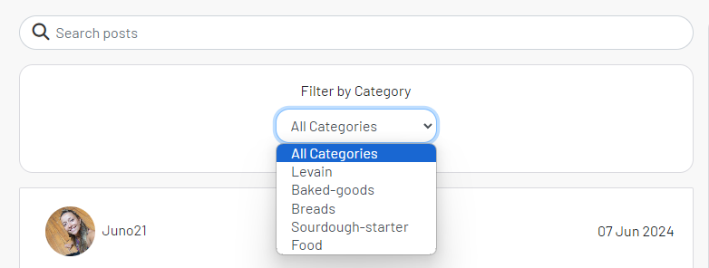 

## Feed page

__The feed page consists of:__

__Feed posts__

The feed page is the page that collects the posts from the users followed profiles.
It's a simple and great way for the user to filter their feed and always be up to date with what their followers are posting. 
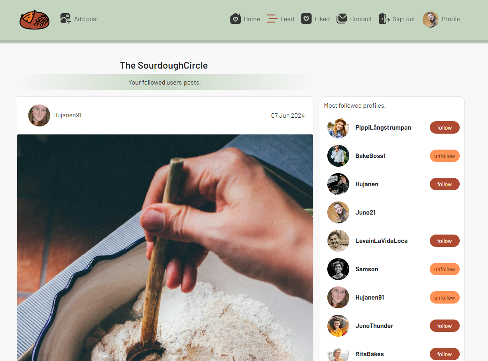 

## Contact Page

__The Contact page consists of:__

__Contact form__

The contact form gives the user a way to contact the admin of the website if they have any questions, need help etc.
The contact form is always available in the navbar no matter if the user is authenticated or not, this to ensure that a user that has trouble with their login or signup easily can contact the admin to be assisted further with their technical issues.

The fields the user needs to fill in is:

    - Name
    - Subject
    - Email
    - Message

_Additional_: All of the fields are required to be filled in, if it's not the user will be prompted to fill in the field before sending. 
The email field needs to contain an email with @ in it to be sent.

A modal will appear when hitting the submit/send button to confirm that the message has been sent, the user can then choose to close the modal and stay on the contact page or hit the "back to feed" button and be sent back to the homepage.

__Purpose of feature:__
Provide users with a way to contact the admin and creator of the site when users need help, wants to ask questions or just vent their opinions. 

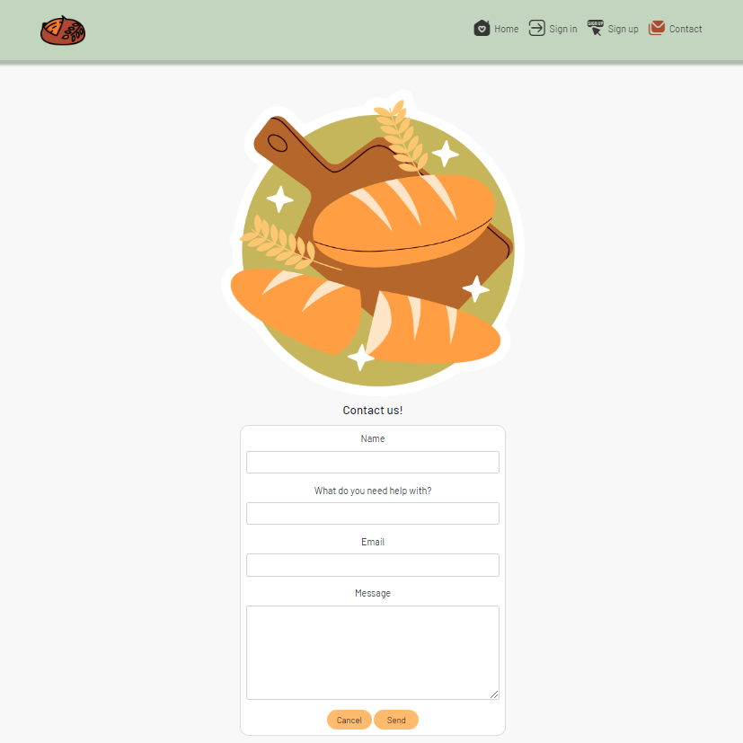 

## Login page

__The Login page consists of:__

__Login form__

The login form allows the user to enter their credentials and authenticate to enter the sites authenticated state.

The login form also contains a link to the [Sign up page](https://3000-hujanen91-sourdoughcirc-97h40xcm3uw.ws-eu114.gitpod.io/signup) in case the user is not already registered.

_Additional_: If the user enters the fields incorrectly or the user isn's recognized the're will be clear messages displaying to make the user aware.

__Purpose of feature:__
Provide users with a way to login to the site. 

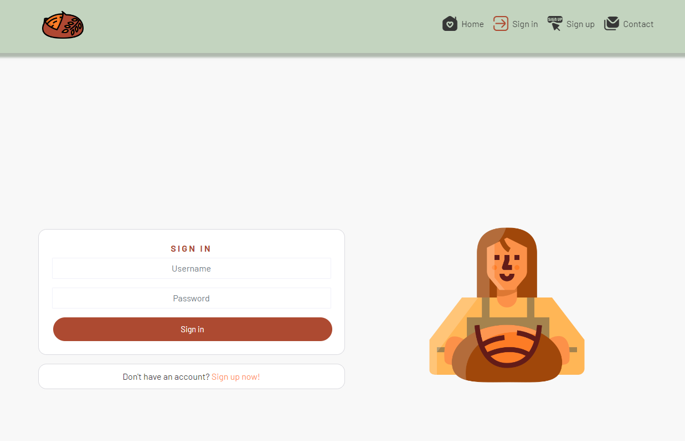 

## Sign up page

__The Register page consists of:__

__Sign up form__

The Sign up form which allows the user to enter credentials for registration on the site, 
it contains all the functionality for a secure registration and displays help text and error text to give the user feedback.

The sign up form also contains a link to the [Sign in page](https://3000-hujanen91-sourdoughcirc-97h40xcm3uw.ws-eu114.gitpod.io/signin) in case the user already has an account.

_Additional_: All of the fields are required to be filled in, if it's not the user will be prompted to fill in the field correctly before being able to sign up. 
The email field needs to contain an email with @ in it for the form to accept the sign up request.

__Purpose of feature:__
Provide users with a way to sign up to the site.

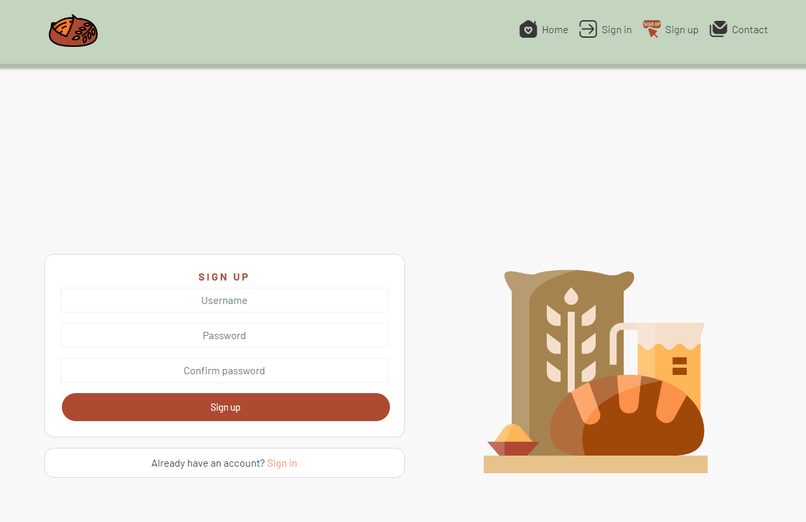 

## Profile page

__The profile page consists of:__

__Profile page and avatar__

The profile page consists of the user avatar, a bio for the user to fill in and give everyone an image of who they are or what they like to post about.
A logged in user is presented with a button to "Follow" or "Unfollow" when navigating to another users profile.
The profile page also presents social media links so others can decide to follow them on other platforms. If a user does not add any socials the icons will be hidden.
The profile page also displays stats about the specific user such as posts posted, followers and how many the user is following.

__Purpose of feature:__
Provides the user with the function to express themselves, present themselves and display to other users who they are. For other users it's a way to get som information about the user and to see what that specific user has posted.

_Additional_: When a logged in user navigates to their own profile three dots will appear up at the top of the right corner of the profile container. Here the user can edit their profile information or delete th

Main view:
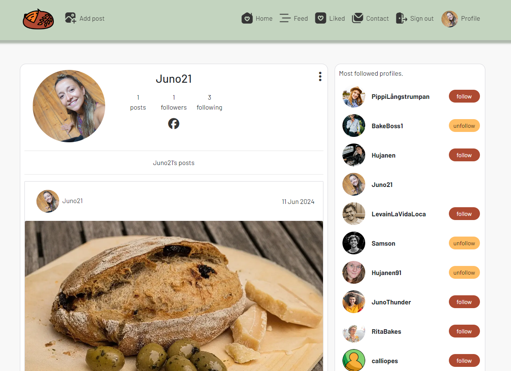 
Other users profile with follow/unfollow button: 
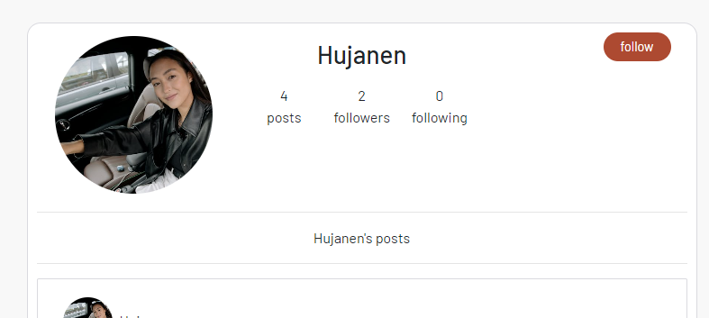 
Edit profile menu: 
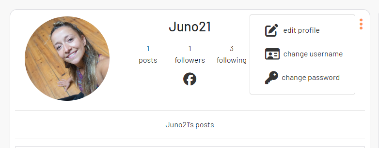 
Edit profile view: 
 
Change username view: 
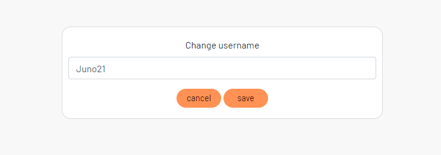 
Change password view: 
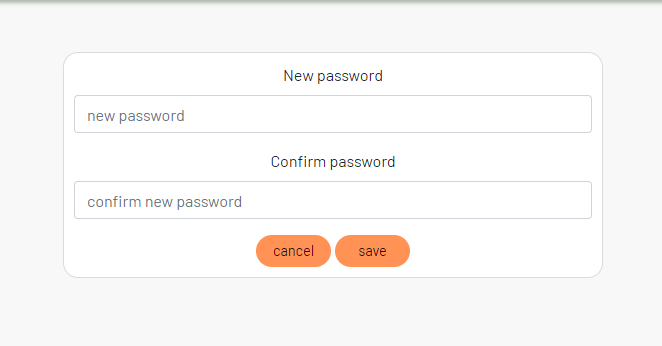 

## Create post
__The Create post page consists of:__

__Creat post field__

In the navbar there's a "Add post" text and icon for authenticated users.
Clicking this button will send the user to the creat post page where the user can upload images, add titel and description and add a category.
After posting the user is sent back to home page where the post is published at the top.

_Additional_: The user will be alerted when required fields are not filled in.
The user will also get an alert when they try to upload images that are too big. 

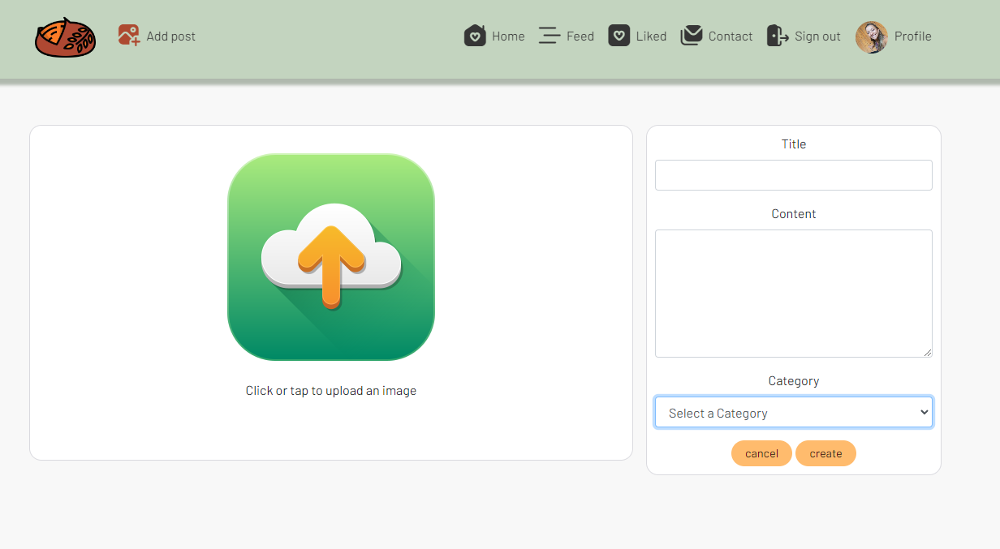 
Requierd fields alerts: 
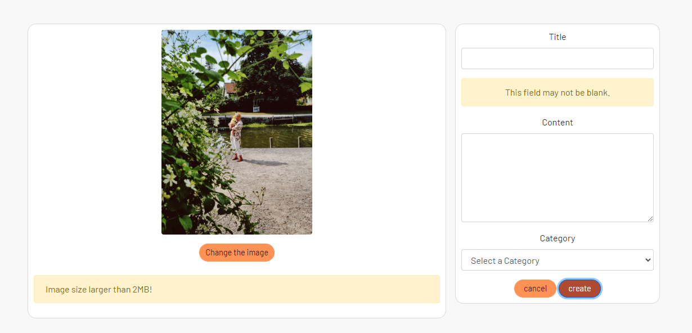 

__The Post page consists of:__

__The post__

When clicking on a specific post the user will be sent to the Post page.
Here logged in users can comment and other users than the creator of the post can like the post.

_Additional_: 
The owner of the post has an option to click on three dots in the right upper corner to get the option to edit or delete their own posts.
The user will get alert messages if image is too big or Title isn't added, this function is identical to the Add post alerts.

__Purpose of feature:__
Provide the user with a detailed view of one specific post and to present the user with the comment field where they can interact and socialize with the post creator and other users. 

Post page view: 
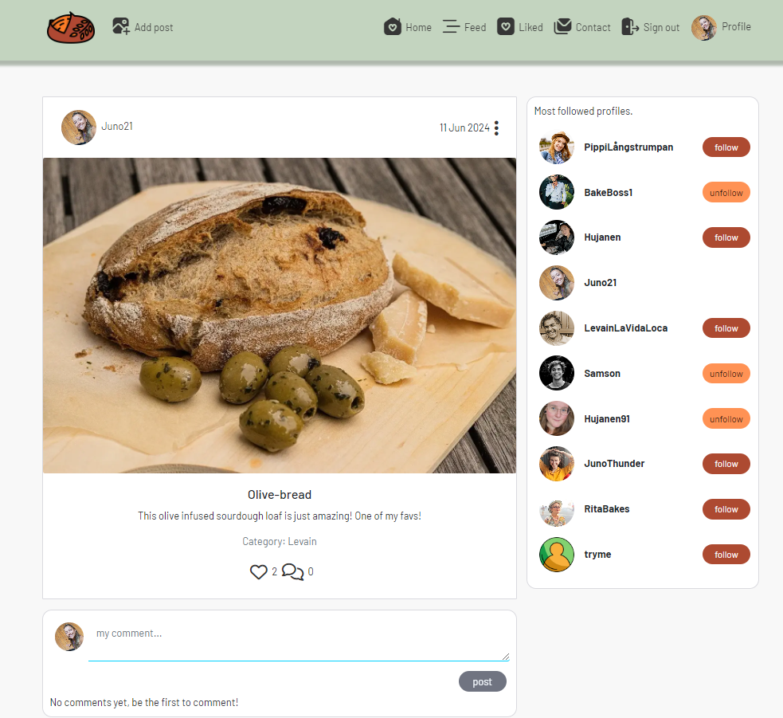 
Post edit menu: 
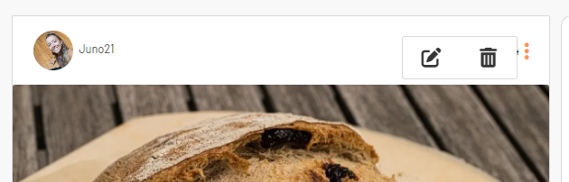 
Post edit view: 
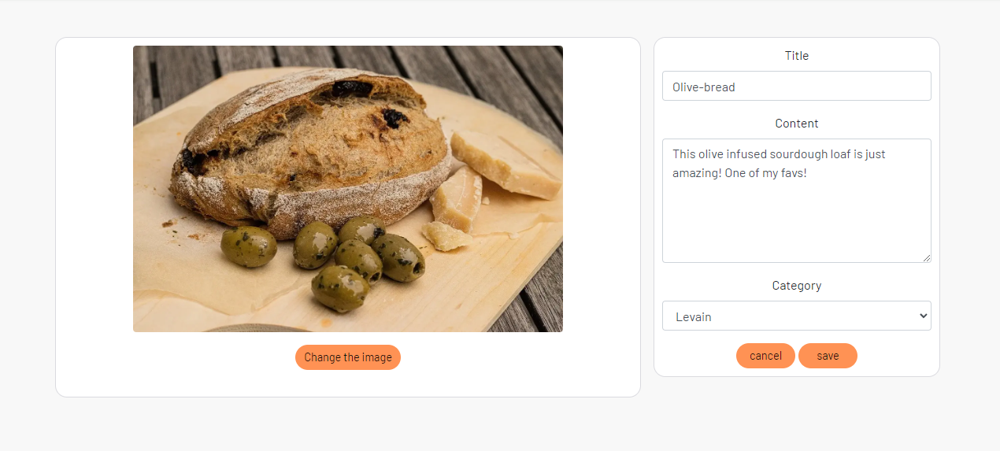 

__Comment section__

The comment section allows users to post comments on a post aswell as delete and edit their comment using the menu displayed to the right in the comment field. 

Comment section: 
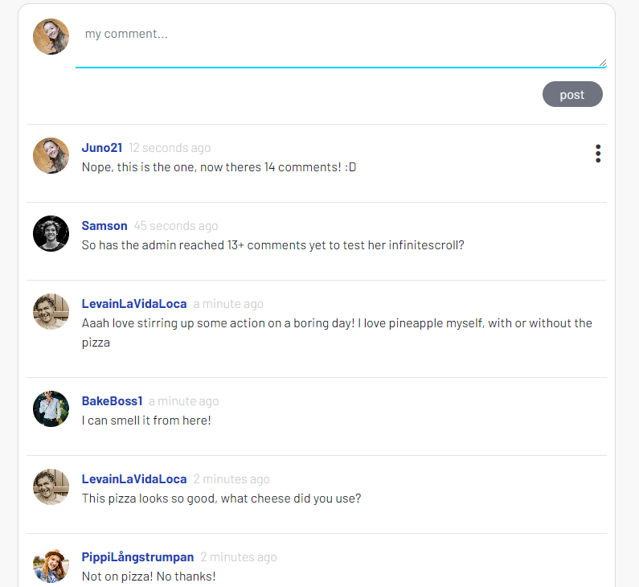 
Comment edit menu: 
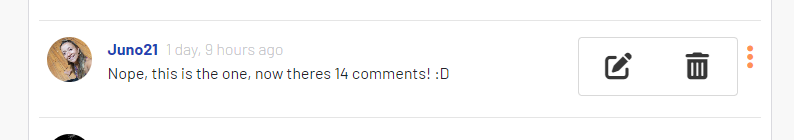 
Comment edit view: 
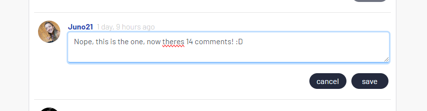 

__Additional functions non visible to users:__

__Infinite scroll__

Infinite scroll is a future that will fetch new posts from the api while the user scrolls to create an infinte scroll. This effect is applied to both posts page, feed, liked feed, comments feed and profile page feed.

## Reusability

<!--In this section, we explore the current reusability of our components and envision future scenarios where our components' flexibility can be further utilized.-->

### Component Reusability

<!--Our application's architecture emphasizes reusability and modularity. Here is an overview of the reusable components:

#### `Avatar.jsx`

- **Description**: Displays user avatars with optional text.
- **Props**:
  - `src`: The image source URL for the avatar.
  - `height`: The size of the avatar (default `45`).
  - `text`: Optional text to display alongside the avatar.
- **Usage**: Used in user profiles, comment sections, and as navigational items.

#### `LikeButton.jsx`

- **Description**: A button for liking posts, with dynamic rendering based on like status.
- **Props**:
  - `isOwner`: Boolean indicating if the current user owns the post.
  - `likeId`: The ID of the like associated with the post, if it exists.
  - `setPosts`: Function to update the state of posts.
  - `postId`: The ID of the post to be liked or unliked.
- **Usage**: Embedded in post components to allow users to like/unlike posts.

#### `NavBar.jsx`

- **Description**: The navigation bar for the application, responsive and adaptive based on user authentication status.
- **Props**: None (utilizes context to determine the current user state).
- **Usage**: Placed at the top of all page layouts for consistent navigation.

#### `Notifications.jsx`

- **Description**: A dropdown component to display user notifications.
- **Props**:
  - `id`: (From `useParams`) The ID used to fetch notifications if needed.
- **Usage**: Included in the `NavBar` for easy access to notifications.

#### `PopularProfiles.jsx`

- **Description**: Displays a list of popular profiles.
- **Props**:
  - `mobile`: Boolean indicating if the view is rendered on a mobile device.
- **Usage**: Utilized in the sidebar or main content area to showcase popular users.

#### `Post.jsx`

- **Description**: Represents a single post in the feed.
- **Props**: Includes post details such as `id`, `owner`, `title`, `content`, and interaction counts.
- **Usage**: Used in profile pages and feeds to display individual posts.

#### `Profile.jsx`

- **Description**: Displays a brief profile summary for a user.
- **Props**:
  - `profile`: Object containing profile information.
  - `mobile`: Boolean for mobile view adjustments.
  - `imageSize`: The size of the profile image (default `55`).
- **Usage**: Showcased in lists where a user profile summary is needed, such as in search results or the popular profiles section.

#### `ProfileInformation.jsx`

- **Description**: Provides detailed profile information, including social media links and follow/unfollow functionality.
- **Props**:
  - `profile`: Object containing detailed profile information.
  - `isOwner`: Boolean indicating if the profile belongs to the current user.
  - `handleFollow`: Function to handle following a user.
  - `handleUnfollow`: Function to handle unfollowing a user.
- **Usage**: Used on the main profile page to display user information and actions.

#### `ProfilePosts.jsx`

- **Description**: Displays a list of posts created by a specific user.
- **Props**:
  - `profilePosts`: The list of posts to display.
  - `setProfilePosts`: Function to update the list of posts.
- **Usage**: Employed in the profile details page to show all posts from a user.

#### `SocialMediaLinks.jsx`

- **Description**: Renders social media icons linked to user profiles.
- **Props**:
  - `profile`: Object containing URLs to social media profiles.
- **Usage**: Included in the `ProfileInformation` component to link to user's social media.

By designing our application with these reusable components, we've created a scalable and maintainable codebase. Each component is crafted to be independent and versatile, promoting consistency and efficiency throughout our development process.-->

### Possible Reusable Scenarios

<!--As we continue to evolve the Caption of the Day platform, we anticipate new features that will further leverage our existing components. Below are some scenarios where our components could be reused or extended:

#### `Avatar.jsx`

- **Future Use**: Incorporating user status indicators (such as online/offline) next to the avatar for real-time social features.
- **Possible Props**:
  - `status`: A string or boolean indicating the user's current status.

#### `LikeButton.jsx`

- **Future Use**: Expansion to support liking comments or other user-generated content beyond posts.
- **Possible Props**:
  - `contentType`: A string indicating the type of content being liked (e.g., 'post', 'comment').

#### `NavBar.jsx`

- **Future Use**: Adding quick-search functionality within the navigation bar for immediate content discovery.
- **Possible Props**:
  - `onSearch`: Function to handle search queries directly from the navigation bar.

#### `Notifications.jsx`

- **Future Use**: Introducing categorization of notifications to filter by type (likes, comments, follows).
- **Possible Props**:
  - `filterType`: An array or string to specify which notification types to display.

#### `PopularProfiles.jsx`

- **Future Use**: Adding filtering options to sort popular profiles by different criteria (e.g., most active, recently joined).
- **Possible Props**:
  - `sortBy`: A string indicating the sorting criterion for popular profiles.

#### `Post.jsx`

- **Future Use**: Implementing a feature to highlight posts based on trending topics or hashtags.
- **Possible Props**:
  - `isTrending`: A boolean to highlight the post if it's associated with a trending topic.

#### `Profile.jsx`

- **Future Use**: Enabling a 'quick view' mode to see more details on hover or click without navigating away from the current page.
- **Possible Props**:
  - `quickViewEnabled`: A boolean to enable the quick view feature.

#### `ProfileInformation.jsx`

- **Future Use**: Adding the capability for users to customize the visibility of certain profile sections to different audience groups.
- **Possible Props**:
  - `visibilitySettings`: An object detailing visibility preferences for profile sections.

#### `ProfilePosts.jsx`

- **Future Use**: Allowing embedding of posts in external websites or sharing via social media platforms.
- **Possible Props**:
  - `embeddable`: A boolean indicating if the post can be embedded.
  - `onShare`: Function to handle sharing the post externally.

#### `SocialMediaLinks.jsx`

- **Future Use**: Expanding to include more social platforms and integrating with APIs to display live social feed previews.
- **Possible Props**:
  - `additionalPlatforms`: An array of new platform identifiers to include in the profile.

These scenarios are guided by our commitment to flexibility and scalability. As we develop new features, we'll continue to assess our component library for opportunities to reuse and extend components, ensuring a consistent and efficient development experience.

## Packages and Tools

In this project, we've utilized a variety of libraries and tools to enhance functionality and development efficiency. Below is a list of these technologies along with their purposes:

- **React**
  - A JavaScript library for building dynamic and interactive user interfaces. Ideal for single-page applications.
  
- **Axios**
  - A promise-based HTTP client for making HTTP requests, used for fetching or saving data from/to a server.

- **Bootstrap & React-Bootstrap**
  - Bootstrap provides responsive design elements and layouts. React-Bootstrap adapts these into React components for consistent styling.

- **JWT-Decode**
  - A library for decoding JSON Web Tokens. Useful for interpreting the token's data on the client side.

- **React Router DOM**
  - Manages navigation in React applications, enabling dynamic routing without page reloads.

- **React Infinite Scroll Component**
  - Implements infinite scrolling, loading content as the user scrolls down, enhancing user experience.

- **Testing Libraries (Jest, React Testing Library)**
  - Jest is a simple testing framework, and React Testing Library provides utility functions for testing React components.

- **Web Vitals**
  - Measures website performance in terms of loading, interactivity, and visual stability.

- **Mock Service Worker (MSW)**
  - Mocks HTTP requests in development and testing environments. Ideal for testing network request scenarios.

- **Scripts for Building, Testing, and Starting**
  - Specific scripts are defined for building, testing, and starting the application, particularly with Heroku deployment in mind.

- **Node.js and npm Versions**
  - The project specifies Node.js and npm versions to ensure a consistent environment setup.

Additionally, specific scripts were defined for building, testing, and starting the application, particularly with Heroku deployment in mind. The project also specifies Node.js and npm versions for consistent environment setup.-->

## Testing

### Manual testing
The SourcdoughCircle has gone through thorough manual testing that can be found here:
[Manual testing](testing.md)

### Performance and Validation

The SourcdoughCircle perfomance, best practice and validation reports can all be found here:
[Perfomance and Validation](testing.md)

### Known Bugs

**Current Status**:  
As of the latest deployment, no major bugs are deployed to the website. There's been a few during production that has been either temporarily solved or left as it is: 

- During production somehow the /Feed and /Likes searchfield and category filtering stopped working. 
Different AI:s was asked about the issue without any of them finding a solution that would work.
Console.logs and console.errors was used to try to pinpoint the issue but the API was fetching everything as it was supposed to.
My mentor looked at it for a moment and couldn't really see where the problem was due to the filtering and searchfield being defined in the same components as the  

      Solution:
      Due to the timelimit of this project this bug had to be either left as it was or hidden. I went with the last option and decided to hide the Searchbar and Category filtering on the /Feed and /Liked pages.
      This solution felt like the better one so that the page did not contain non functional features for the users.
      The Homepage still has these futures and they are working perfectly on that page and is fetching the right data.

- The like and comment count on /Feed and /Liked page also stopped working probably at the same time as the previus bug above. The icons are displayed just as they should and the like button is clickable and is acting as it should. 
The comment count on the other hand is not working as it should and is not displaying. 
If a user likes the post and then unlike it the word "NaN" is appearing next to the like icon. The "NaN" will then be gone if the user updates the page and the icon will still be marked as "liked". 

      Solution: 
      This has been left as it is due to the timelimit but also due to it not being such an extreme bug and it functions as it should apart from not displaying the numbers.

**Devtools**

Websocket warning:
A websocket warning is happening in the console in devtools. After searching in Slack for this issue I found out it is a known bug and something with some packages in the background non reachable to the user.
Different solutions was tested withouth any success.

## Deployment

### Heroku

This project is deployed on Heroku, a cloud platform service that enables easy deployment and scaling for web applications. The deployment process includes the following steps:

#### Initial Setup

1. **Create a Heroku Account**: Sign up for a Heroku account at [Heroku's website](https://www.heroku.com/).
2. **Install Heroku CLI**: Download and install the Heroku Command Line Interface (CLI) to interact with Heroku from your local machine.

#### Preparing the Application

1. **Procfile**: Create a `Procfile` in your project root directory. This file tells Heroku how to run your application.
2. **Requirements.txt**: Ensure you have a `requirements.txt` file listing all project dependencies.
3. **Config Vars**: Set up necessary configuration variables in Heroku (like `SECRET_KEY`, database URL, etc.).

#### Deployment

1. **Create a Heroku App**: Use the Heroku CLI to create a new app.
2. **Add Buildpacks**: If necessary, add the correct buildpacks via the Heroku dashboard or CLI.
3. **Deploy**: Push your code to Heroku either by connecting your GitHub repository to Heroku or using the Heroku CLI to deploy your application.
4. **Database Migration (if applicable)**: Run database migrations using the Heroku CLI.

#### Final Steps

1. **Enable the Web Dyno**: Make sure the web dyno is up and running after deployment.
2. **Open the App**: You can open your application from the Heroku dashboard or using the CLI command `heroku open`.

For more detailed instructions and troubleshooting, visit the official [Heroku Dev Center](https://devcenter.heroku.com/).

### Forking the GitHub Repository

Forking the GitHub repository allows you to make a copy of the original project on your own GitHub account, enabling you to make changes without affecting the original. Here's how to do it:

1. **Go to the Repository**: Navigate to the original repository on GitHub.
2. **Fork the Repository**: Click the 'Fork' button, located at the top right of the repository page. This creates a copy of the repository in your GitHub account.
3. **Clone Your Fork**: Once forked, you can clone your fork to your local machine for further development.

### Making a Local Clone

Cloning a GitHub repository creates a local copy on your machine, allowing you to sync between the two locations. Here are the steps:

1. **Clone the Repository**: On the GitHub repository page, click the 'Code' button and copy the URL under 'Clone with HTTPS'.
2. **Open Terminal**: Open your terminal and navigate to the directory where you want the clone to be created.
3. **Clone Command**: Type `git clone`, and then paste the URL you copied in Step 1. Press Enter to create your local clone.

## Credits

[Modal pop up in ContactForm](https://react-bootstrap.netlify.app/docs/components/modal/)

### Content

<!--This project has benefited from several educational resources and example projects provided by the Code Institute throughout the course of my bootcamp. The following projects deserve special mention for their direct impact on the development of this application:

- **Django REST Framework Example Project**: A practical example provided by the Code Institute that guided the development of Web APIs using Django REST framework. This project served as a template for best practices in API development with Django and Python.

- **Moments Project**: Another resource from the Code Institute, the Moments project was instrumental in illustrating the development of a full-stack application with a focus on user experience. Various aspects of its design and functionality have been adapted and incorporated into this project.

A heartfelt thank you goes to the Code Institute for the array of projects and resources that have been made available throughout my bootcamp. These resources have not only guided this project but have also been a cornerstone of my learning journey, providing me with a solid foundation in software development and a deep understanding of full-stack development practices.-->

### Media

<!--The visual content for this project was sourced from Pixabay and generated using DALL-E by OpenAI:

- **Pixabay Images**: A variety of high-quality images were sourced from [Pixabay](https://pixabay.com/), a platform offering free-to-use, royalty-free images. These images were carefully chosen to enhance the visual aspect of the project.
- **DALL-E Generated Images**: Specific imagery was created using [DALL-E](https://openai.com/dall-e), OpenAI's AI image generator, to produce unique and tailored visuals for the project.-->